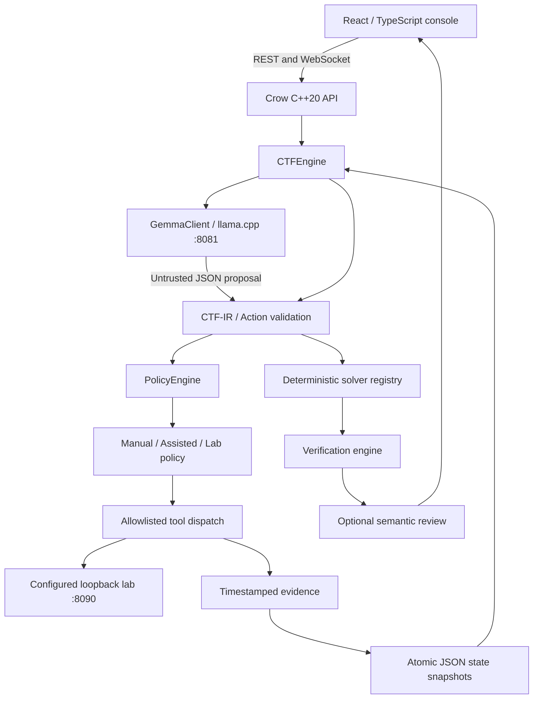

# Architecture and maintenance notes

## Trust boundaries

The user request defines the implementation task; the attached proposal supplies architecture and feature requirements. Instructions embedded in challenge text, imports, model completions, and HTTP observations have no execution authority. The model receives fixed role instructions and serialized untrusted context separately. JSON parsing does not grant permission: C++ checks the allowed tool, every argument key, relative URL, configured origin, response size, and approval policy.

The practical classes in the proposal are mapped to cohesive modules rather than empty class wrappers. `validateSpec` owns the schema boundary; `solve` and `capabilities` are the registry; `verify` owns verification; `PolicyEngine` validates action proposals; `executeTool` is the controlled router; `CTFEngine::Run`, `event`, and `save` own state, evidence, and persistence; `GemmaClient` owns inference transport. This keeps data flow explicit without introducing placeholder implementations.

## State transitions

- Submission: `queued`.
- Mode A: `running` → interpret → validate → execute → verify → optional review → `computed`, `verified`, `needs_review`, or `rejected`. Missing challenge data or two invalid interpretation attempts produce `needs_input` with specific questions.
- Mode B: `running` → plan/policy → optional `awaiting_approval` → execute → observe → replan → `evidence_verified` or `needs_input`.
- Any running path can end `failed` or `stopped`.
- After a process restart, previously running/awaiting runs become `stopped` with an interruption explanation. They never execute automatically.

`computed` means computational checks passed without a positive semantic review. `evidence_verified` means a flag has an observed provenance chain, not a scoreboard acceptance. `needs_input` means the plan or budget ended without a verified flag. Steps count attempted tools; failed model-proposed tools can be replanned within the remaining budget. Schema/policy violations fail closed rather than invoking a fallback tool.

## Synchronization and durability

The engine index has a mutex. Each run has its own mutex, atomic cancellation flag, and approval condition variable. Workers never hold a run mutex during inference or network I/O. An approval is tied to an immutable action ID and consumed once; a stale approval cannot authorize a different proposal. Engine destruction signals every worker and joins owned threads.

Each evidence append and state transition is saved as a new full JSON snapshot using a temporary file followed by atomic rename/replace. Evidence is append-only through application APIs. This is not a cryptographically tamper-evident store; a local administrator with file write access can modify records. Corrupt snapshots are retained on disk and skipped at startup. Store the data directory on a reliable local filesystem and back it up before changing storage versions.

## Bounds

Graph inputs are limited to 128 nodes and 4096 edges to keep Floyd–Warshall verification bounded. Encoding input is at most 64 KiB. Request JSON is at most 128 KiB at route validation; local loopback binding is essential because this is not an internet-facing upload service. Agent tools accept at most 64 KiB of argument/response data. The maximum agent budget is 32 steps, with a 250 ms inter-step interval. There is no arbitrary regex, process execution, or unrestricted filesystem tool.

The current allowlist provides local target isolation, not an operating-system sandbox. The optional lab fixture is a small separate Python service used only as a target/test fixture. It is not part of the application backend.

## Adding capabilities

1. Define a strict CTF-IR or action parameter contract and document its output shape.
2. Add the identifier to the registry and wire schema; reject unsupported algorithms explicitly.
3. Bound time, memory, input size, and numerical ranges before execution.
4. Add an independent oracle, inverse operation, structural proof, or honestly labelled recomputation strategy.
5. Add normal, malformed, boundary, and tampered-result fixtures.
6. Add an editable UI example only after its real end-to-end execution passes.

For a new network tool, require explicit operator-controlled origin configuration, prohibit redirects/control-plane access, validate headers, preserve source provenance, and decide which approval modes can execute it. Never infer authorization from a model's `reason` text.

## Design system

The base layout lives in `frontend/src/styles.css`; the operator workbench theme is in `cyberpunk.css`. Monospace body text, condensed headings, red panel outlines, yellow actions, and cyan interaction states follow the user's game-menu reference. Input and execution sit side by side on desktop and stack on phones. Native CSS SVG cursors provide a cyan arrow and yellow targeting reticle without tracking JavaScript; text fields retain the text cursor. Motion respects reduced-motion preferences. Graphs and exports use actual engine data.

## Local model contract

`GemmaClient` in `gemma.cpp` owns persisted endpoint settings, health/model discovery, role schemas, and cancelable inference. Analyst JSON is constrained at both the outer and nested pipeline envelopes; C++ still validates all values. One schema repair is permitted. A model-provided missing-input response never causes execution. Reviewer output must cover both input fidelity and answer relevance. For textual answers, its stated answer must exactly match C++ output before receiving a positive verdict. This catches attempted model corrections, but semantic model review remains fallible and distinct from deterministic proof.

Pipelines contain one to eight non-nested specs. `$previous` resolves only against the previous step's actual text. Verification reconstructs every dependent input, independently checks each result, compares the saved check record, and confirms that the exposed final answer equals the final step. Binary intermediates require an explicit supported representation; they are never silently converted to text.
